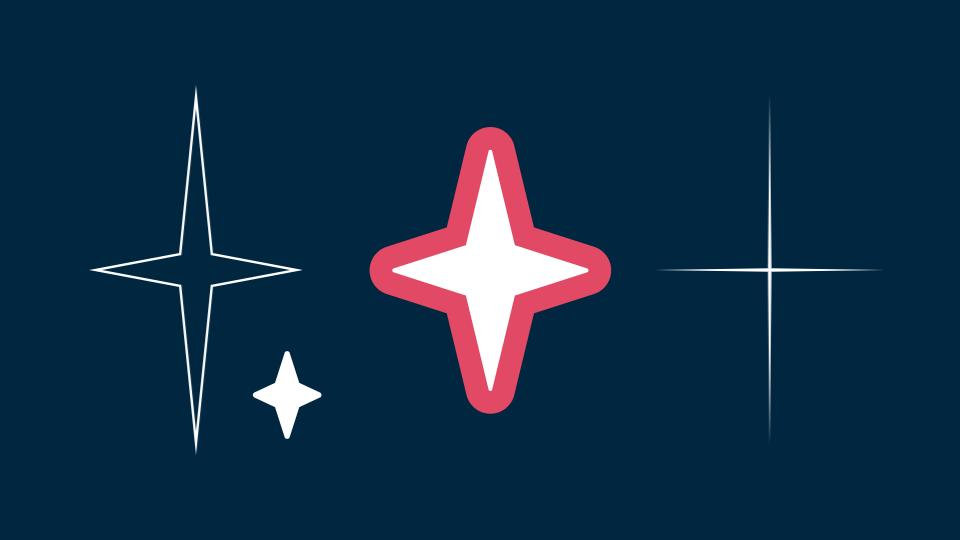
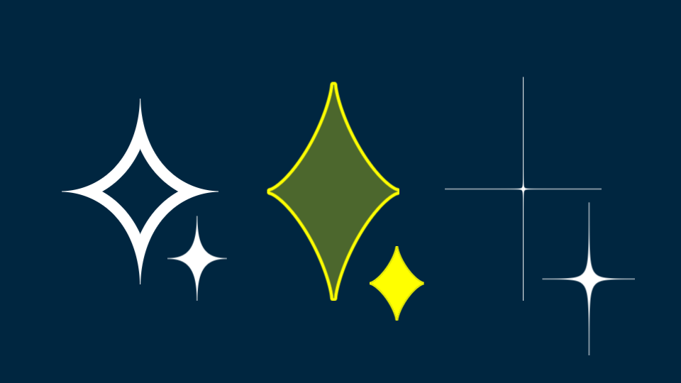

# twinkle_sl

色々な形の✨を手軽に作れるカスタムオブジェクトです。 
細い角までジャギーにならずに綺麗に描画できます。 
ピクセルシェーダーで描画しているので、とても軽い（はず）です。

**直線@twinkle_sl**

**カーブ@twinkle_sl**

## 導入・削除・更新

### 導入
1. `@twinkle_sl.obj2`ファイルをダウンロードしてください。
2. ダウンロードしたファイルを、スクリプトフォルダあるいはその子フォルダの中に配置してください。
3. AviUtl2を再起動してください。

> [!Note]
> スクリプトフォルダは、AviUtl2の 
> 「『その他』メニュー > アプリケーションデータ > スクリプトフォルダ」から開くことができます

### 削除
導入したファイルを削除してください。

### 更新
導入したファイルを最新版に上書きしてください。

## 使い方
タイムラインに`直線@twinkle_sl`/`カーブ@twinkle_sl`を配置してください

> [!Note]
> デフォルトでは「カスタムオブジェクト」カテゴリ内にあります。

## オブジェクトの設定項目

### 直線@twinkle_sl
- `サイズ`：図形の高さ
- `幅[%]`：図形の幅。`サイズ`に対する比率で指定します。
- `深さ[%]`：値が大きいほど鋭い星形になります。
- `角丸[%]`：角を丸くする大きさ。値が大きいほど丸くなります。
- `ライン幅[%]`：線の太さ。`サイズ`に対する比率で指定します。
- `ライン幅を絶対値として設定する`： 
  チェックを入れると`ライン幅[%]`の値がそのままラインの太さになります。
- `ライン位置`：線を描画する位置
- `角の形状`：**`角丸[%]`の値が0の場合の**角の形状
  - `マイター`：尖った角
  - `ラウンド`：丸い角
- `ライン`：線の色
- `ラインα`：線の不透明度
- `塗り`：塗りの色
- `塗りα`：塗りの不透明度

### カーブ@twinkle_sl
- `サイズ`：図形の高さ
- `幅[%]`：図形の幅。`サイズ`に対する比率で指定します。
- `深さ[%]`：値が大きいほど鋭い星形になります。
- `ライン幅[%]`：線の太さ。`サイズ`に対する比率で指定します。
- `ライン幅を絶対値として設定する`： 
  チェックを入れると`ライン幅[%]`の値がそのままラインの太さになります。
- `ライン位置`：線を描画する位置
- `ラインを最低1px残す`: 
  チェックを入れると、細くて消える角部分が1px残るようになります。お好みでどうぞ。
- `ライン`：線の色
- `ラインα`：線の不透明度
- `塗り`：塗りの色
- `塗りα`：塗りの不透明度

## 動作確認環境
AviUtl ExEdit2 Beta16

## Credits
`カーブ@twinkle_sl`にInigo Quilezさんの[squircleの符号付き距離関数](https://www.shadertoy.com/view/7stcR4)のコードを改変して使用しています。

## Licence
本スクリプトは[MITライセンス](../LICENSE)の元、公開されています。

## Change Log

### v1.0
初版を公開
